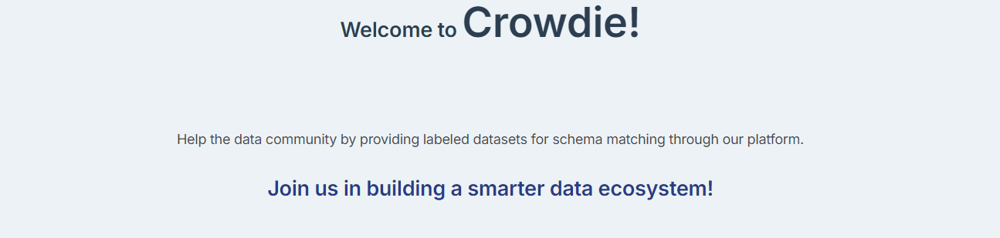
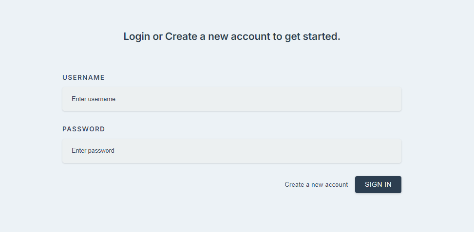
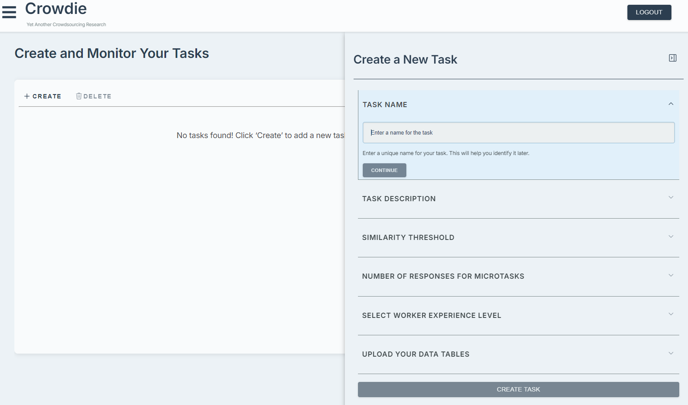
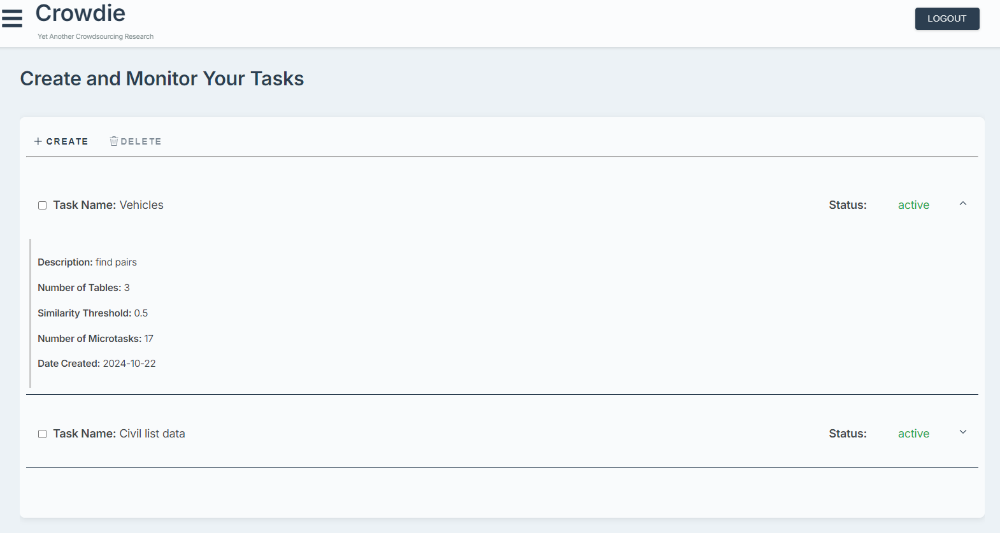
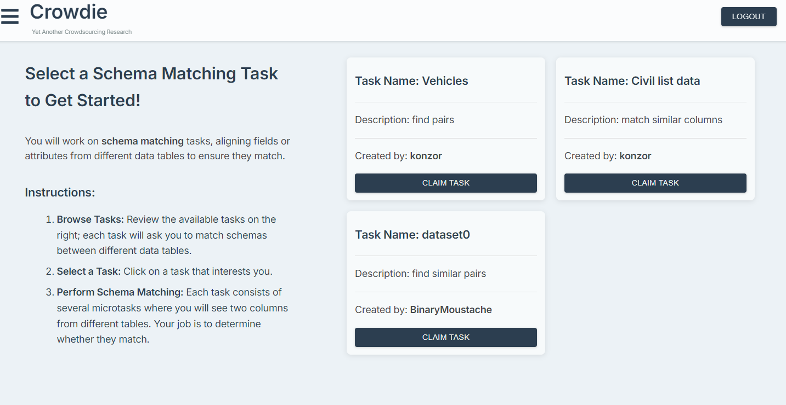
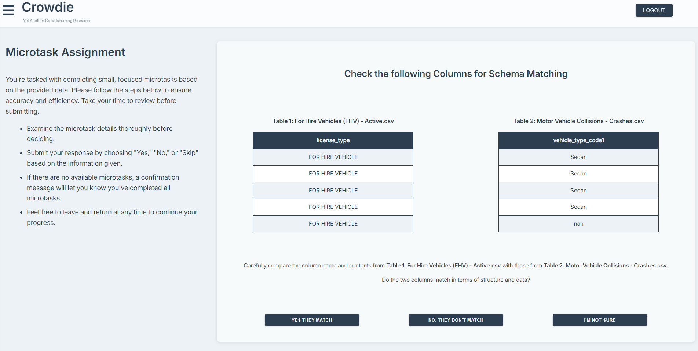

# Crowdie 



**Crowdie** is a prototype application designed for a crowdsourcing platform that enhances the creation and validation of labeled datasets for schema matching. 

## Key Features

- **Upload CSV Tables**: Users can create schema matching tasks tailored to their specific data needs by uploading CSV files.
  
- **Automated Similarity Generation**: The platform employs advanced algorithms to automatically generate similar pairs based on schema characteristics.

- **Crowd Verification**: Engage the community to verify data matches, ensuring high-quality results and boosting trust in the outputs.

## Technologies Used

- **Frontend**: [React.js](https://reactjs.org/) - A JavaScript library for building user interfaces.
  
- **Backend**: [FastAPI](https://fastapi.tiangolo.com/) - A high-performance web framework for building RESTful APIs.

- **Database**: [SQLAlchemy](https://www.sqlalchemy.org/) with [PostgreSQL](https://www.postgresql.org/) for asynchronous data interactions.

- **Containerization**: [Docker](https://www.docker.com/) and [Docker Compose](https://docs.docker.com/compose/) for managing application environments and services.


## Application Overview 
### Authentication
Upon visiting the application, users must log in if they already have an account or sign up to create a new one.



The following fields are required for registration:
- **Username**
- **Password**
- **Computer Science Background** (Yes/No)
- **Level of Studies**
- **Years of Experience**

The last three fields assist in assigning tasks to specific crowd workers based on their qualifications, ensuring that tasks are matched with users who possess the appropriate expertise.

### Task Creation Page

One of the core functionalities of the platform is the ability to create tasks for schema matching.



Users need to provide the following information:
- **Task Name**: A brief identifier for the task.
- **Description**: Detailed information about the task's objectives and requirements.
- **Similarity Threshold**: Specifies the similarity requirement between column pairs. 
  > **Note**: <small> When the similarity score is 0, only schema mapping will be utilized. However, if the similarity score is greater than 0, both schema mapping and schema similarity that utilize text embeddings from a pretrained text encoder  and cosine similarity will be employed. This approach allows users to maintain flexibility based on their specific targeting needs.</small>
- **Number of Required Answers**: Set between a minimum of 3 and a maximum of 7 answers.
- **Experience Requirement**: Specify whether the task requires an experienced user (Yes/No).
- **Upload Tables**: At least 2 tables must be uploaded for similarity analysis.

Once the task is submitted, a new task will be created in the database, along with all its associated microtasks (possible pairs) that require verification.

In the same interface, users can monitor the status of the tasks they created or delete a task if needed. They can always create new tasks as well.



The task status can be:
- **Pending**: Microtasks are still being created.
- **Active**: Microtasks have been successfully created and require verification from the crowd.
- **Completed**: All microtasks have gathered responses from the required number of crowd workers. Users can then download the labeled results, which are currently generated through a simple majority voting mechanism.

### Crowd Pages

Another key functionality of the platform is that every user can participate as a crowd worker for tasks created by the community.



Users can select a task to complete, which will transfer them to the microtask page where microtasks from the selected task will be presented.



As a crowd worker, the user can answer the task with three possible choices:
- **Yes**: This indicates that the column pair from the two tables matches.
- **No**: This indicates that the column pair does not match.
- **Skip**: This option allows the user to skip the current microtask without providing an answer.

Every selection keeps track of which microtasks the current user has seen, allowing them to progress to the next microtask. Each answer is timed, and when all available microtasks have been completed, a message will appear indicating that the user has completed all available microtasks for the current task.


## Installation

To check Crowdie locally follow the steps below.

### Prerequisites
- **Docker**: Ensure you have Docker installed. [Click here to install Docker](https://docs.docker.com/get-docker/).
- **Docker Compose**: Docker Compose is included with Docker Desktop. For standalone installations, [click here](https://docs.docker.com/compose/install/) for installation instructions.

### Steps to Set Up

1. **Clone the Repository**:
    ```bash
    git clone https://github.com/BinaryMoustache/Crowdie-Schema-Matching.git
    cd Crowdie-Schema-Matching
    ```

2. **Build and Run with Docker**:
    If you have Docker and Docker Compose installed, run the following command to build and start the application:
    ```bash
    docker-compose up --build
    ```

3. **Stopping the Application**:
    To stop the application, use:
    ```bash
    docker-compose down
    ```

4. **Cleaning Up Containers and Images** (Optional):
    If you want to remove unused containers and images, you can run:
    ```bash
    docker system prune
    ```

### Development
If you want to experiment with the code, check the respective README files for instructions on running the application in development settings:
- [Backend README](/backend/README.md)
- [Frontend README](/frontend/README.md)

## Future Plans

- **Settings**: A settings page where users can update their information and delete their accounts.

- **User Profile and Analytics Page**: A dedicated page for users to view analytics related to their tasks and microtasks. This page will include:
  - Insights into how crowdkers have answered.
  - Average time taken to complete tasks.
  - A summary of the user's completed tasks, including the correctness of answers provided.

--- 
As always happy coding.